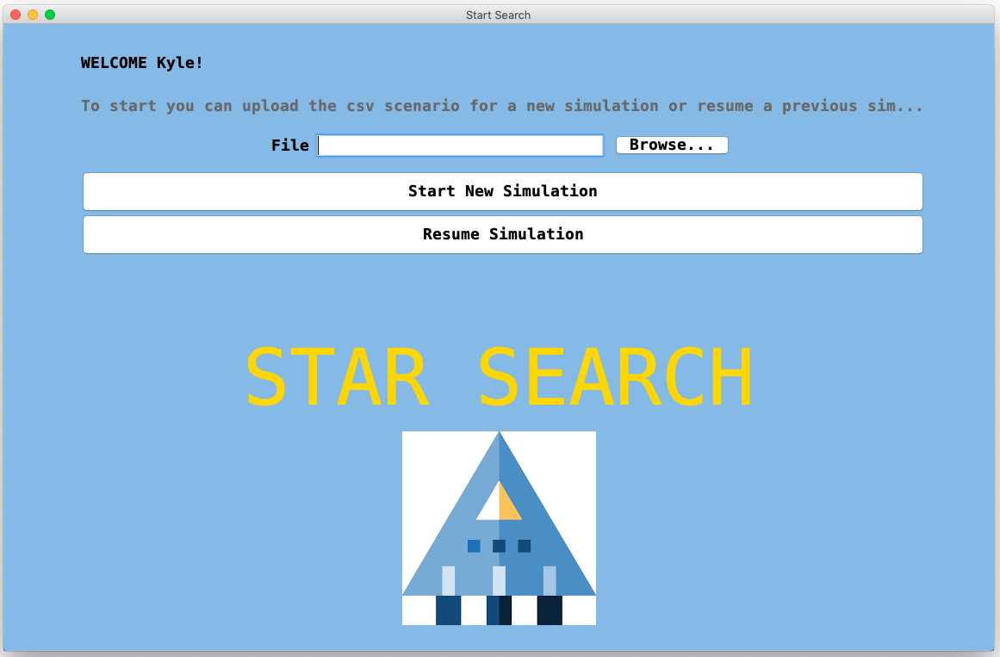

# Welcome to Voyager Team 26: Star Search Java Project
---
Star Search Java project is a simulation desktop application that allows for users to be able to simulate
and verify search strategies according to various initial input scenarios of drones exploring a defined space region.

#### Contributors:
---
Asiya Gizatulina: asya.asha@gatech.edu

Dennis Eddington: dennis.eddington@gatech.edu

Fernanda Tello: ftello@gatech.edu

Gabriel Rushin: grushin3@gatech.edu

Kenneth Kang: kjkang11@gatech.edu

## Setting up and Running the application:
---
We included a bash script that will install and compile all necessary packages for this application at the root directory of this project.

Simply run the following command at the root directory of the project to start this application:
```
bash ./run.sh
```

## Application Walkthrough:
---
### Login Page
---


When application starts, login page opens to prompt the user to submit a username.
Because all following simulation states will be stored under this username in MongoDB,
it is important for the user to remember this user name in order to later restore the latest simulation state.  

### Landing Page
---


When user enters the username, application searches for previously stored simulation state under the username.

Notice how `Resume Simulation` button is disdabled. This is because the user information was not found in the database.

Let's click on the `Browse...` button to find a desired `scenario` file to initiate a simulation.


Start the simulation by clicking on `Start New Simulation`

### Main Simulation Page - Start
---


Above page loads when the simulation successfully initiates from a scenario file.

#### Icons


This drone icon represents drone's location on the map. Number next to the icon shows drone's unique id.
Icon's orientation reflects drone's current orientation with the top side of the page being `North`.


This star icon represents an unexplored star. `?` mark next to it shows whether drones discovered the star.


This icon shows the location of suns.

#### Simulation Navigation
* `NEXT` button will execute one iteration of all active drone's actions the user to go to the next step of the simulation.
 This button will not do anything after the simulation already reached the end.
* `BACK` button will restore simulation state before `Next` button was clicked.
 This button will not do anything if the simulation is already at the beginning.
* `FAST FORWARD` button will fast-forward the simulation until the simulation terminates when all drones are destroyed
 or simulation reaches its termination state from the scenario file.
 This button will not do anything after the simulation already reached the end.
* `STOP` button can be pressed whenever user wants to stop the simulation, save the simulation, and quit. This button will take the user back to the login page.

Let's continue the simulation by clicking `NEXT`

### Main Simulation Page - Middle
---


Left side of the simulation page under `--- CURRENT PROGRESS ---` shows the list of all drone actions and their results.


Once the simulation reaches its end, `Summary Report` popup window shows and overall summary of the simulation result.

**Click on `OK` button to show the final state of the simulation.**

```$xslt
NOTE: execution log file will be generated if and only if the user clicks on this OK button
```

 

Click `STOP` button to save this state to the data base and go back to the login page.

Login with the previously entered username.

### Resume Simulation
---


We now see the `Resume Simulation` button is enabled.

Click on `Resume Simulation` button to restore simulation state from your previous session.

### Drone Execution Log File
---


This is an example execution log file. This file is generated at the root of the project as `expo_results.csv`
when the user reaches the end of the simulation and clicks `OK` to the summary report pop up window.